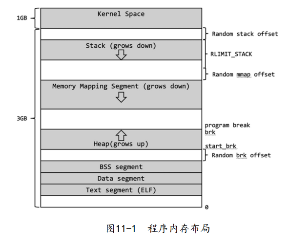
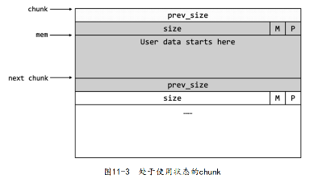
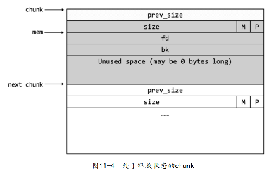

# 堆利用

## 堆

+ 低地址向高地址增长的线性区域
+ 
+ 用户向操作系统申请内存，内存区域被内核分配出来，较大连续的内存区域，若不够才再次增长，存在BSS段的高地址处
+ 堆通过brk()和sbrk()控制大小，堆未初始化时program_break指向BSS段末尾，调用这两个函数来移动器指向使得堆增长

### glibc的堆

+ 用户申请堆按照顺序分配，用户保存指向这些堆块的指针(allocated chunk)，释放堆块(free chunk)的时候，glibc将释放的堆块组织成链表(bin)，相邻的两个堆块都为释放状态，则合成一个新的堆块。解决内存碎片问题。
  + bin被细分为：fast bin,small bin,large bin...在其中的chunk被称为：fast chunk,small chunk,large chunk...

### arena

+ arena包含一片或数片连续的内存，堆块将会从这片区域划分给用户。主线程的arena被称为main_arena，它包含start_brk和brk之间的这片连续内存
+ 主线程的arena只有堆，子线程的arena可以有数片连续内存。如果主线程的堆大小不够分的话可以通过brk()调用来扩展，是子线程分配的映射段大小是固定的，不可以扩展，所以子线程分配出来的一段映射段不够用的话就需要再次用mmap()来分配新的内存。

### malloc_chunk

+ 定义
  + prev_size：上一个chunk若为free，则表示其大小，否则为其一部分供其使用
  + size：当前chunk大小，2*SIZE_SZ整数倍 SIZE_SZ取决于系统位数 4 或者 8 byte
  + IS_MAPPED：标识上一个chunk是否是由mmap()中获得的。用户申请一个相当大内存时，malloc会通过mmap()分配一个映射段
  + PREV_INUSE：标识上一个chunk的状态，1则被分配，0则未分配。
  + fd,bk：当前chunk释放时，会加入bin中，而fd和bk用于指向该chunk中bin链表中上一个和下一个的free chunk。如果chunk使用，则这两个字段无效，用做用户空间
  + fd_nextsize,bk_nextsize：和fd,bk类似，但只用于large bin，分别指向前后第一个和当前chunk大小不同的chunk
+ 使用时的chunk
  + 
+ 释放时的chunk
  + 
+ 总结一下glibc如何在malloc_chunk上节省内存。：
  + 首先，prev_size仅在上一个chunk为释放状
    态时才需要，否则它会加入上一个chunk的user data部分，节省出一个SIZE_SZ大小的内存。其
    次，size最后三位由于内存对齐的原因，被用来标记chunk的状态。最后，fd和bk仅在释放状态下
    才需要，所以和user data复用，节省了2* SIZE_SZ大小的内存。fd_nextsize和bk_nextsize仅在当
    前chunk为large chunk时才需要，所以在较小的chunk中并未预留空间，节省了2 *SIZE_SZ大小
    的内存

### bin

+ fast bin
  + LIFO
  + 其中chunk不会合并，则其PREV_INUSE始终为1，序号为0的chunk为4*SIZE_SZ 以2 *SIZE_SIZE递增
+ small bin
  + 同一个small bin里chunk的大小相同，采用双链表结构，使用频率介于fast bin和large bin之
    间。small bin在bins里居第2到第63位，共62个。根据排序，每个small bin的大小为
    2*SIZE_SZ*idx（idx表示bins数组的下标）。在64位系统下，最小的small chunk为2×8×2=32字
    节，最大的small chunk为2×8×63=1008字节。由于small bin和fast bin有重合的部分，所以这
    些chunk在某些情况下会被加入small bin中。
+ large bin
  + large bin也是采用双链表结构，里面的chunk从头结点的fd指针开始，按大小顺序进行排
    列。为了加快检索速度，fd_nextsize和bk_nextsize指针用于指向第一个与自己大小不同的
    chunk，所以也只有在加入了大小不同的chunk时，这两个指针才会被修改
+ unsorted bin
  + 一定大小的chunk被释放时，在进入small bin或者large bin之前，会先加入unsorted bin。
    在实践中，一个被释放的chunk常常很快就会被重新使用，所以将其先加入unsorted bin可以加快
    分配的速度。unsorted bin使用双链表结构，并采用FIFO（先进先出）的分配策略。与fastbinsY
    不同，unsroted bin中的chunk大小可能是不同的，并且由于是双链表结构，一个bin会占用bins
    的两个元素。
