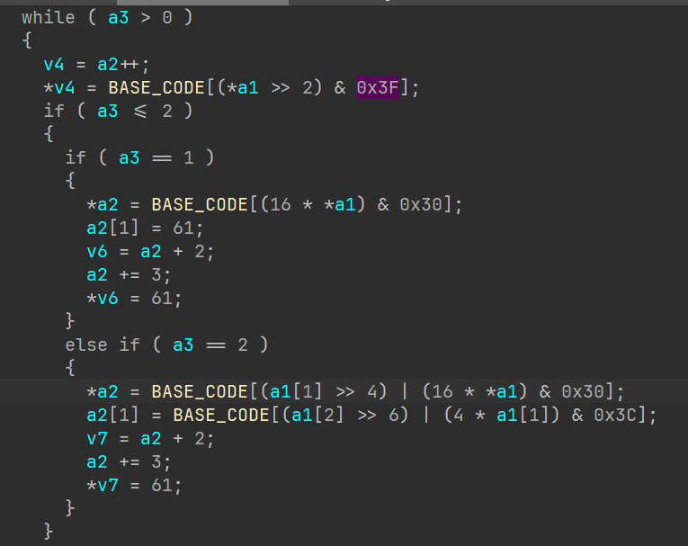

# re

## 算法实践与标识

### RC4

+ ```python
  def init(box, key):
      for i in range(256):
          box[i] = i
      j = 0
      for i in range(256):
          j = (j + box[i] + key[i % len(key)]) % 256
          box[i], box[j] = box[j], box[i]

  def crypt(box, input):
      output = []
      k = 0
      for i in range(len(input)):
          j = (i + 1) % 256
          k = (box[j] + k) % 256
          box[k], box[j] = box[j], box[k]
          output.append(box[(box[j] + box[k]) % 256] ^ input[i])
      return bytes(output)

  data = [0xC3,0x82,0xA3,0x25,0xF6,0x4C, 0x36,0x3B,0x59,0xCC,0xC4,0xE9,0xF1,0xB5,0x32,0x18,0xB1, 0x96,0xAe,0xBF,0x08,0x35]
  box = [0] * 256
  init(box, b'[Warnning]Access_Unauthorized')
  print(crypt(box, data)) 
  ```
+ 魔改：s盒长度、%256、输入的data进行换表base64
+ 标识：主要是看初始化s盒子的循环，取余256和异或操作

  + 初始化s盒函数、
  + 加解密函数

### XTEA

+ ```c
  #include<stdio.h>
  int main()
  {
  	unsigned int enc[] = { 0xC11EE75A, 0xA4AD0973, 0xF61C9018, 0x32E37BCD, 0x2DCC1F26, 0x344380CC };
  	unsigned int key[] = { 0x00010203, 0x04050607, 0x08090A0B, 0x0C0D0E0F };
  	int i,j;
  	long sum,delta=0x61C88647;//0x9e3779b9
  	for (i = 0; i < 6; i+=2)
  	{
  		sum = -(delta * 32);
  		for (j = 0; j < 32; j++)
  		{
  			enc[i+1] -= (((enc[i] >> 5) ^ (16 * enc[i])) + enc[i]) ^ (key[(sum >> 11) & 3] + sum);
  			sum += delta;
  			enc[i] -= (((enc[i+1] >> 5) ^ (16 * enc[i+1])) + enc[i+1]) ^ (key[sum & 3] + sum);
  		}
  	}
  	printf("%s", enc);
  	return 0;
  }
  ```
+ 魔改：delta数值，异或，移位，与
+ 标识：
  + 加减可替换加密解密（逆序）异或和delta值
+ 总结 https://bbs.kanxue.com/thread-266933.htm

### base64

+ ```python
  from base64 import b64decode
  def decode(s):
  old_table = 'ABCDEFGHIJKLMNOPQRSTUVWXYZabcdefghijklmnopqrstuvwxyz0123456789+/='
  new_table = '0123456789XYZabcdefghijklABCDEFGHIJKLMNOPQRSTUVWmnopqrstuvwxyz+/='
  t = ''
  for i in s:
  t += old_table[new_table.index(i)]
  return b64decode(t)
  ```
+ 魔改：换表魔改，有的可能魔改其中的算法
+ 标识：有64长度的table、对于奇数偶数有判断循环替换
  + 

### md5

+ for循环嵌套四组
  + <64
    + <16
    + <32
    + <48
    + <64
+ 标识：%16
+ 标识：&& ^ |连续出现
+ 表

### sha1

### DES

+ 常用表
+ 
+ 
+ 算法组成
  + 定义置换表 S盒
  + 子密钥生成函数
  + DES轮函数
  + 主函数
