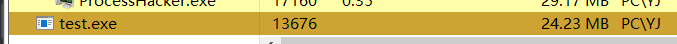

# 古早C2，RevengeRat的分析

> 当初接触他还是在初中的时候，拿他去班级多媒体上线了

## 静态分析

+ 上VT乐一下，还有11个厂商没报毒是挺逆天的，16年的老rat了
+ 
+ 分析接发函数加解密的调用
+ 看看字段
  + ```c#
    		// Ownered 是否拥有 与MUTEX护斥锁配合使用
    		public bool OW;

    		// this.C = new TcpClient; Tcp客户端对象
    		public object C;

    		// bool flag = !this.Cn; 作为Connected标识
    		public bool Cn;

    		// this.SC = new Thread(new ThreadStart(this.MAC), 1); C2主进程对象线程
    		public object SC;

    		// this.PT = new Thread(new ThreadStart(this.Pin)); 休眠状态对象线程
    		public Thread PT;

    		// this.INST = new Thread(new ThreadStart(this.INS));互斥排查线程
    		public Thread INST;

    		// 功能点遍历变量，bool flag = this.I == 0;为1时进行系统信息查询保存为data
    		public int I;

    		// 休眠毫秒
    		public int MS;

    		public string[] Hosts;

    		public string[] Ports;

    		public string ID;

    		public string MUTEX;

    		// 标识 this.INV(this.Hosts[this.H], this.Ports[this.P], array[4], array[5]
    		public int H;

    		// 标识 this.INV(this.Hosts[this.H], this.Ports[this.P], array[4], array[5]
    		public int P;

    		// 截断符号，分隔符
    		public static string SPL = "*-]NK[-*";

    		// 自启动执行路径
    		public static string App = Application.ExecutablePath;

    		// c2主对象
    		public static Atomic SCG = new Atomic();

    		// 查询系统信息
    		public static ComputerInfo DI = new ComputerInfo();

    		// C2SeverKey
    		public static string Key = "Revenge-RAT";

    		public static Mutex MT;
    ```
+ 分析函数
  + Decompress 解压函数主要使用Gzip 用于对传输文件/数据的解压
  + fx 切割数据便于传输
  + GAW 获取当前windows窗口名称
  + GetProduct 获取系统版本名称
  + GVI 获取硬盘卷信息
  + HWD 获取硬件信息
  + INS 互斥相关
  + CIVC 摄像头信息
  + INV 获取系统信息
  + LA 接收C2服务器信息
  + MAC C2主程序 与服务器交互相关
  + MP 获取CPU信息
  + OP 同上
  + SB 保存字节流信息
  + BS 同上
  + Send 发送数据
+ 分析插件
  + 分析了这么多函数，为什么找不到和服务端一样的功能点呢？
  + 因为这些功能都被作为插件使用Gzip压缩为XX.dll使用了
  + 例如键盘记录的
  + 
  + 对此不展开分析，此古早RAT的模式非常好，现如今还是有各种C2使用这种模式。高度可自定义化，体积小方便快速。

## 流量分析

+ 
+ 就是通讯常用的base64，最后用*-]NK[-*做了分割，有的内容进行了Gzip压缩

## 动态分析

+ 启动
+ 
+ 隶属于启动方式所以在资源管理器下，权限是使用者PC\YJ
+ 网络
+ 
+ 使用40336端口对接5050端口 TCP协议
+ 太常规了...放到如今就是裸奔的状态

## 功能分析

客户端

+ 常规
  + 文件管理
  + 屏幕显示
  + 摄像头显示
  + 录音
  + 键盘记录
  + 系统管理
  + 上传下载
  + 执行脚本
+ 额外
  + 弹窗
  + 聊天
  + 磁力seeder
  + 提权

服务端

+ 常规
  + 多上线设置
  + 唯一标识，互斥
  + 启动（路径，注册表，计划任务）
  + 自启动（startup目录，多格式调用启动）
  + PS脚本
  + 捆绑
  + 劫持HOSTS
  + 运行提示框
  + 图标，资源设置
+ 额外
  + 注入设置
  + 蠕虫传播
  + 自带防护
  + 编译欺骗
  + 体积伪装

### 当我看到这些功能的时候我真觉得找到宝贝了，如同瑞士军刀，缺点就是自己做免杀比较困难，行为非常的明显，流量明显，C2地址不能隐藏
