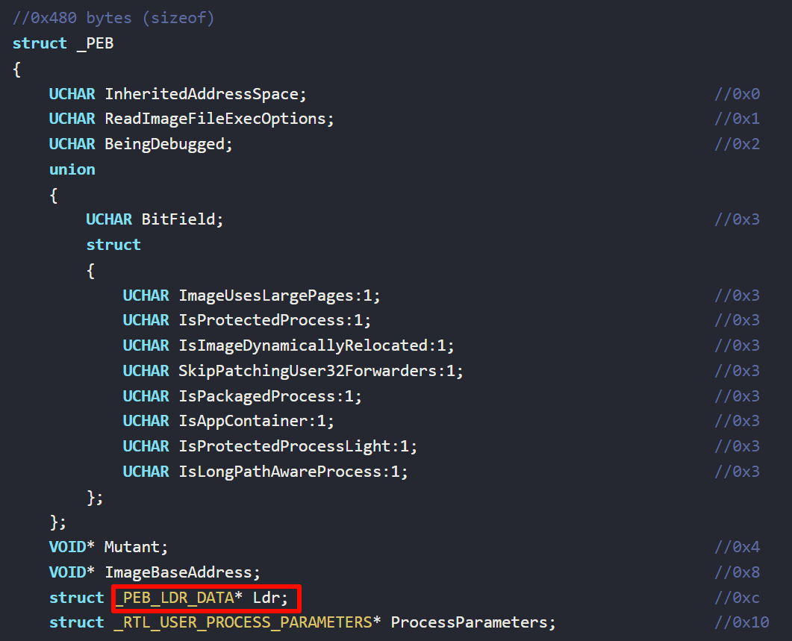
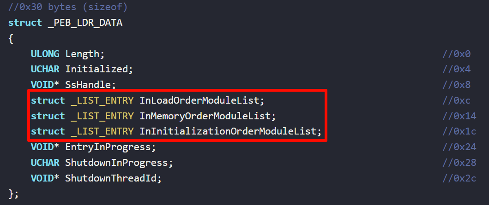
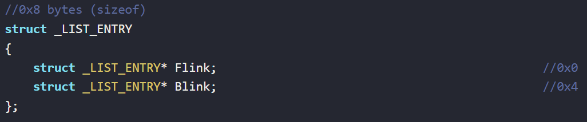
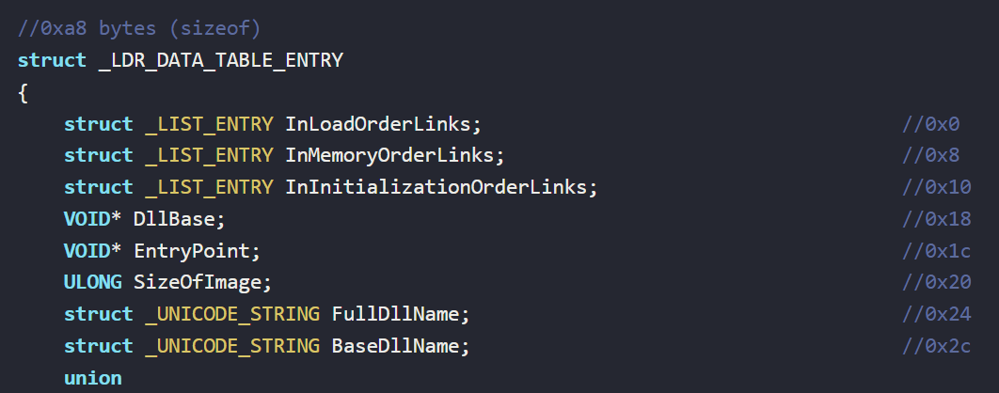
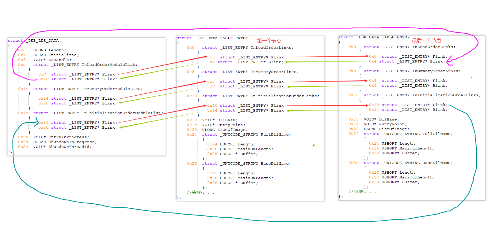
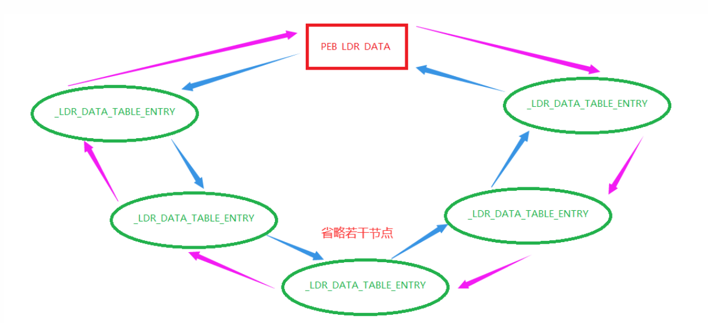

# PEB_TEB

> https://xz.aliyun.com/t/13556

## PEB

在Windows操作系统中，PEB是指" Process Environment Block "，它是一个数据结构，用于存储有关进程的信息，每个进程都有一个对应的 PEB 结构体。PEB提供了许多关于进程状态和环境的信息，它是用户模式和内核模式之间的一个关键接口。
我们利用 PEB 可以完成很多事情，比如说动态获取 api，进程伪装，反调试等等。

## TEB

TEB指的是线程环境块" Thread Environment Block "，用于存储线程状态信息和线程所需的各种数据。每个线程都有一个对应的TEB结构体，并且 TEB 结构的其中一个成员就是 PEB。

## PEB

x86 pTEB->0x30 = PEB

x64 pTEB->0x60 = PEB

找

其中三个表

* `InLoadOrderModuleList`：一个双向链表，按照模块加载的顺序列出模块。
* `InMemoryOrderModuleList`：一个双向链表，按照模块在内存中的顺序列出模块。
* `InInitializationOrderModuleList`：一个双向链表，按照模块初始化的顺序列出模块。

表结构都一样

第一个成员 Flink 指向下一个节点，Blink 指向上一个节点，所以这是一个双向链表，当我们从_PEB_LDR_DATA 结构中取到 InInitializationOrderModuleList 结构时，这个结构中的 Flink 指向真正的模块链表，这个真正的链表的每个成员都是一个 LDR_DATA_TABLE_ENTRY 结构。
之前的 _PEB_LDR_DATA 只是一个入口，这个结构只有一个，它不是链表节点，真正的链表节点结构如下图

对应关系

可以看到这是一个以PEB_LDR_DATA为起点的一个闭合环形双向链表。
每个_LDR_DATA_TABLE_ENTRY节点结构中偏移为0x30处的成员为dllName，偏移为0x18处的成员为DllBase。
通过遍历链表，比较dllName字符串内容可以找到目标模块的所属节点。
通过节点成员DllBase可以定位该模块的DOS头起始处。
通过对PE结构的解析可以搜索导出表，从而可以取到指定的导出函数地址。
