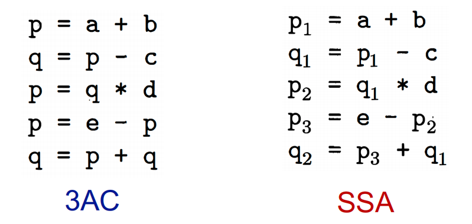
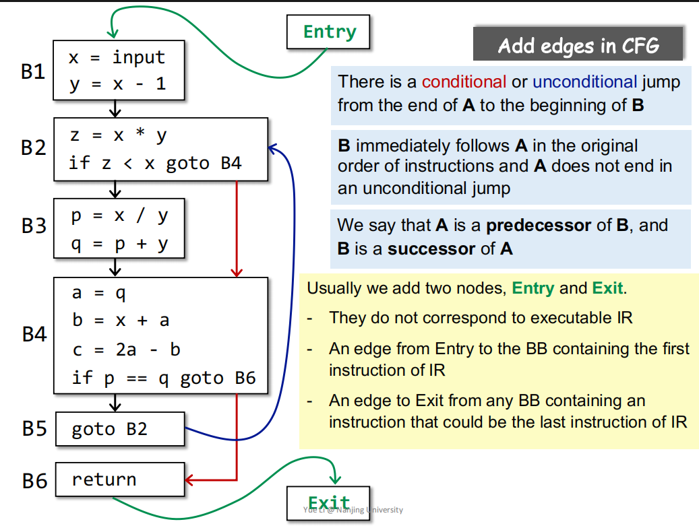

# IR

## 3AC 三地址码

    等号右边只有一个操作符

## SSA 静态单赋值

    变量新名字 传播用 每个变量定义一次

## Control Flow Analysis 控制流分析

    Control Flow Graph CFG 控制流程图

## Basic  Blocks BB

    Basic blocks (BB) are maximal sequences of consecutive three-address instructions with the properties thatIt can be entered only at the beginning, i.e., the first instruction in the blockIt can be exited only at the end, i.e., the last instruction in the block

    基本块(BB)是连续三地址指令的最大序列，其性质为它只能在开头输入，即在块中的第一条指令它只能在结束时退出，即块中的最后一条指令

## 一个完整的CFG

    

# Data Flow Analysis

## Overview

    Preliminaries of Data Flow Analysis

    Reaching Definitions Analysis

    Live Variables Analysis

    Available Expressions Analysis

## Preliminaries of Data Flow Analysis

### Input and Output States 输入输出状态

* 每一条IR的执行，都会使状态从**输入状态**变成新的**输出状态**
* 输入/输出状态与语句前/后的 **program point** 相关联。

在数据流分析中，我们会把每一个PP关联一个数据流值，代表在该点中可观察到的抽象的程序状态。

### 关于转移方程约束的概念

分析数据流有前向和后向两种：

### 关于控制流约束的概念

每条语句 s 都会使程序状态发生改变。

B 的输出自然是其输入在经过多次转换后得到的状态。

而 B 的输入要根据数据流分析的需求，对其前驱应用合适的 meet operator 进行处理。后向分析时亦然。

### 不会涉及到的概念

* 函数调用 Method Calls
* 我们将分析的是过程本身中的事情，即 Intra-procedural。而过程之间的分析，将在 Inter-procedural Analysis 中介绍
* 变量别名 Aliases
* 变量不能有别名。有关问题将在指针分析中介绍。
