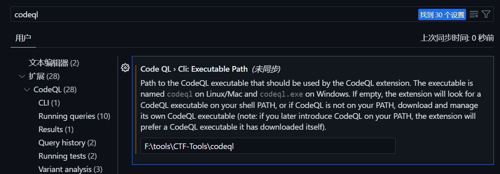

# CodeQL

## 简介

CodeQL 是一种强大的静态代码分析工具，可以帮助开发者发现代码中的潜在问题和漏洞；
CodeQL会提取源码中的相关信息以及数据之间的相互关系，并根据这些信息生成CodeQL数据
库；
这样CodeQL就将代码分析过程转化成了数据库查询过程，可以执行CodeQL查询(简称QL)来查询代
码库；
GitHub 研究人员和社区贡献者提供了大量的标准CodeQL查询供我们使用，我们也可以自己编写
QL来进行自定义分析。

## 开始

> 参考 [大佬博客](https://damit5-github-io.vercel.app/%E4%B8%AA%E4%BA%BA%E7%9F%A5%E8%AF%86%E5%BA%93/02.%E4%BB%A3%E7%A0%81%E5%AE%A1%E8%AE%A1/03.codeql)

+ 首先需要 JDK 和 Maven
+ 下载 https://github.com/github/codeql-cli-binaries/releases
+ 添加path环境变量
+ 下载 https://github.com/github/codeql 解压到codeql目录
+ 安装VSCODE CODEQL插件
+ 配置

## 测试1

+ 环境 https://github.com/WebGoat/WebGoat
+ 编译 mvnw.cmd clean install
+ 运行 mvnw.cmd spring-boot:run
+ 创建数据库 codeql database create /WebGoat-db --language=java --command='mvn clean install -DskipTests' --source-root=F:\tools\CTF-Tools\codeql\source\WebGoat-main --overwrite
+ 解决格式化问题 .\mvnw.cmd spotless:apply

## 测试2

+ https://github.com/l4yn3/micro_service_seclab/
+ codeql database create F:\tools\CTF-Tools\codeql\databases\micro  --language="java"  --command="mvn clean install --file pom.xml" --source-root=F:\tools\CTF-Tools\codeql\micro
+ ```
  这里使用maven编译的时候会导致不成功，可以在pom.xml文件中加入如下代码
  <dependency>
  <groupId>org.apache.maven.plugins</groupId>
  <artifactId>maven-compiler-plugin</artifactId>
  <version>3.8.1</version>
  </dependency>
  <plugin>
  	<groupId>org.apache.maven.plugins</groupId>
  	<artifactId>maven-surefire-plugin</artifactId>
  	<version>2.22.2</version>
  	<configuration>
  		<skipTests>true</skipTests>
  	</configuration>
  </plugin>
  ```
